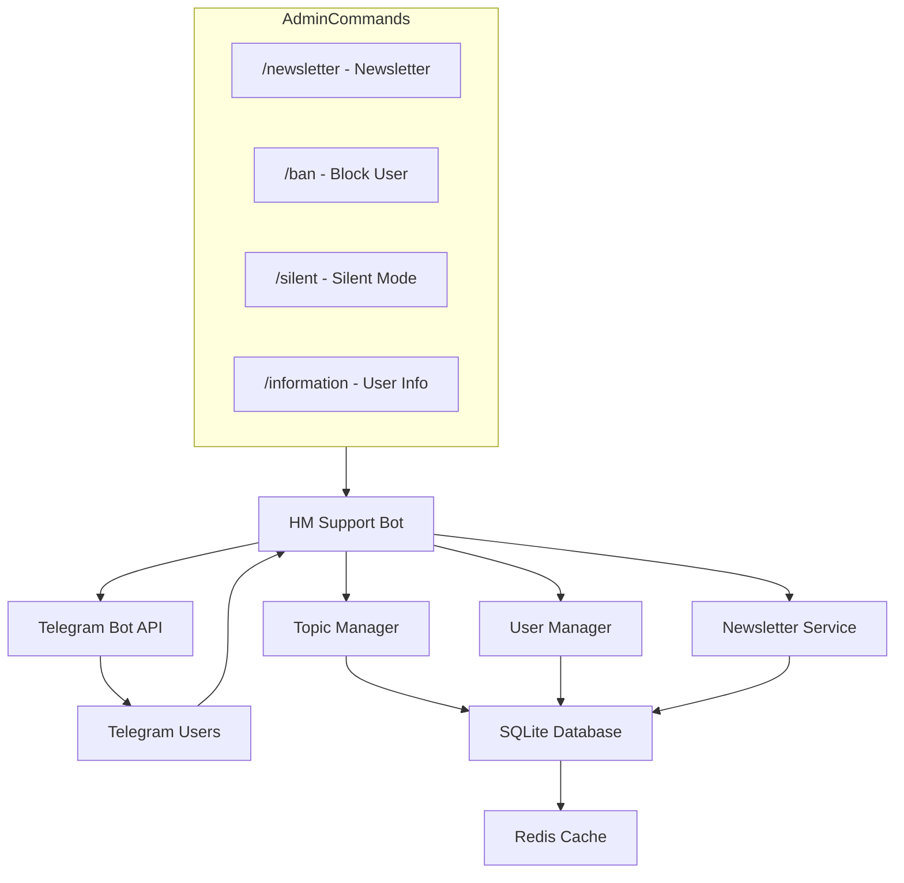

# HM Support Bot


Telegram feedback bot for customer support. Messages from private chats are automatically routed to forum topics in a support group, and staff replies are forwarded back to the user.

## Features

- **Forum topics** — a dedicated topic is created for each user in the support group
- **Two-way messaging** — user messages go to the topic, staff replies go back to the DM
- **Media groups** — album support (photos, videos, audio, documents)
- **Blocking** — `/ban` to block/unblock users
- **Silent mode** — `/silent` disables reply forwarding for a specific user
- **Newsletter** — `/newsletter` for mass messaging via aiogram-newsletter
- **Localization** — English and Russian with per-user language selection
- **Throttling** — spam protection with configurable cooldown
- **Policy engine** *(optional)* — declarative YAML rules to auto-reply, tag, close, suppress notifications, or skip topic creation
- **LLM drafts** *(optional)* — classify the first message and suggest a reply to the manager via inline buttons (any OpenAI-compatible provider)

## C4



## Quick Start

1. deps: Linux, Docker, Python 3.11+, Redis
2. env: `cp .env.example .env` and fill in the variables
3. install: `pip install -r requirements.txt`
4. dev: `python -m app`
5. prod: `docker compose up -d`

## Policy & AI extensions

Both layers are **off by default** — leaving the env vars at their defaults
keeps the bot behaving exactly as without them.

### Policy engine

Declarative rules in a YAML file decide what happens to incoming messages and
lifecycle events, with no business logic in the code.

```bash
cp config/policy.example.yaml config/policy.yaml   # then edit
# in .env:
POLICY_ENABLED=true
POLICY_CONFIG_PATH=config/policy.yaml
```

Matchers: `event_type` (`user_message` | `user_started` | `user_stopped` |
`topic_created`), `keywords_any`, `regex`, `message_length`, `has_link`,
combined with `all` / `any`. Actions: `auto_reply`, `set_tag`, `close_topic`,
`escalate`, `suppress_group_notify`, `suppress_topic_creation`. See
`config/policy.example.yaml` for a documented example.

Manager commands in a topic: `/template <key>`, `/tag [name]`, `/close`,
`/escalate`.

### LLM drafts

| Env var | Default | Description |
|---|---|---|
| `AI_PROVIDER` | `none` | `none` disables; `openai_compatible` enables |
| `AI_BASE_URL` | `https://openrouter.ai/api/v1` | OpenAI-compatible base URL |
| `AI_API_KEY` | _(empty)_ | API key; empty also disables |
| `AI_MODEL` | `openai/gpt-5-nano` | Model id |
| `AI_SYSTEM_PROMPT_PATH` | `config/system_prompt.txt` | System prompt file |
| `AI_TIMEOUT_S` | `8` | Per-request timeout |

When enabled, the first message of a conversation is classified and a draft
reply is posted into the topic with **Send / Skip** buttons. Install the extra
dependency with `pip install -r requirements-ai.txt` (or build the image with
`--build-arg INSTALL_AI=1`).
